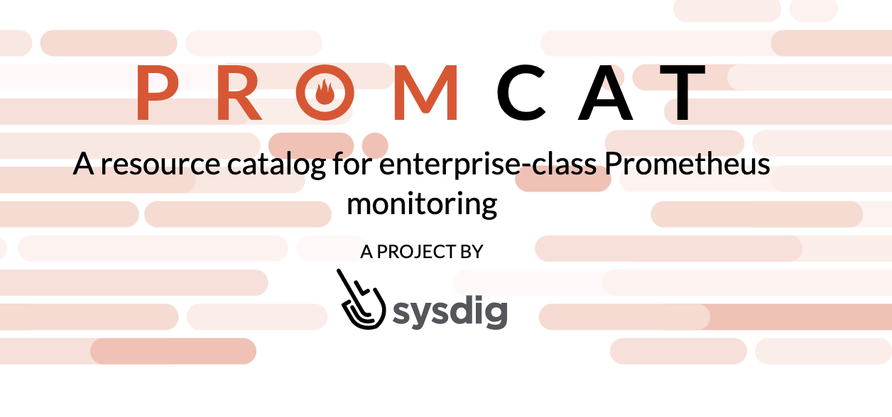
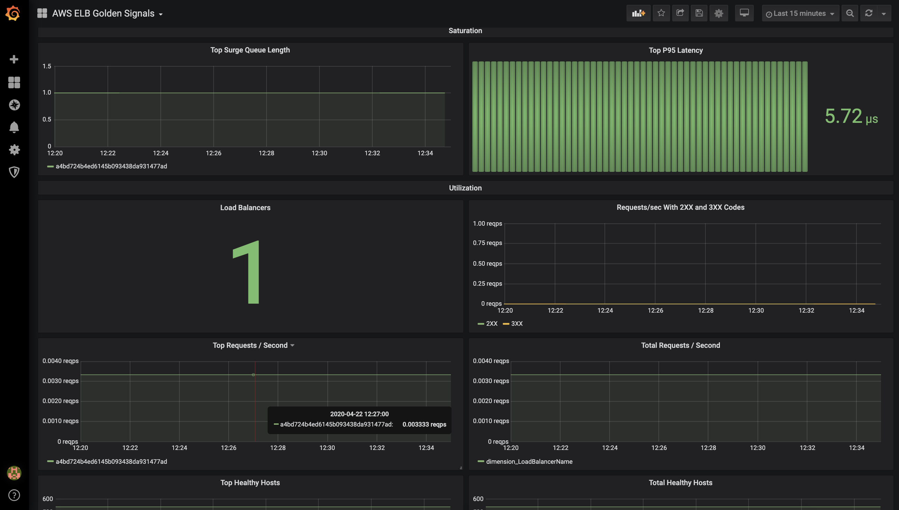

<p align="center"></p>
<p align="center"><b>A Resouce Catalog for enterprise-class Prometheus Monitoring</b></p>

<hr>

# Promcat.io

[](COPYING)

#### Latest releases

Read the [change log](CHANGELOG.md).


### Installing Promcat

You can find the latest releases  on the official [website](http://promcat.io/)

To begin testing with this repo:

1. Navigate to yace

2. run 
    ```
    cat ~/.aws/credentials | base64
    ```

3. Replace the credentials in "yace_secret_copy.yaml" with the base64 encoded credentials, and rename the file to "yace_secret.yaml"

4. To launch a prommetheus and grafana helm chart with the installed agent's and dashboards pre-loaded.
    ```
    make up
    ```


#### How do you compare Promcat with other prometheus catalogs?

One of the questions we often get when we talk about Promcat is “How does Promcat differ from other AWS resource exporters?". Promcat was written on top of [YACE](https://github.com/ivx/yet-another-cloudwatch-exporter) and was custom built to be customizable, and low resource usage compared to other exporters availible. Some of the benefits include:

    1.  Auto discovery of resources via tags

    2. Automatic adding of dimension labels to metrics

    3. Automatic adding of tag labels to metrics

    4. Filter monitored resources via regex

    5. Configurable Decoupled-scraping which makes the exporter to scrape Cloudwatch metrics in background in fixed intervals (5minute default), in stead of each time that the '/metrics' endpoint is fetched to reduce API costs.

    6. Allows exports metrics with CloudWatch timestamps (disabled by default)


### Example of ELB monitoring dashboard


<p align="center"></p>